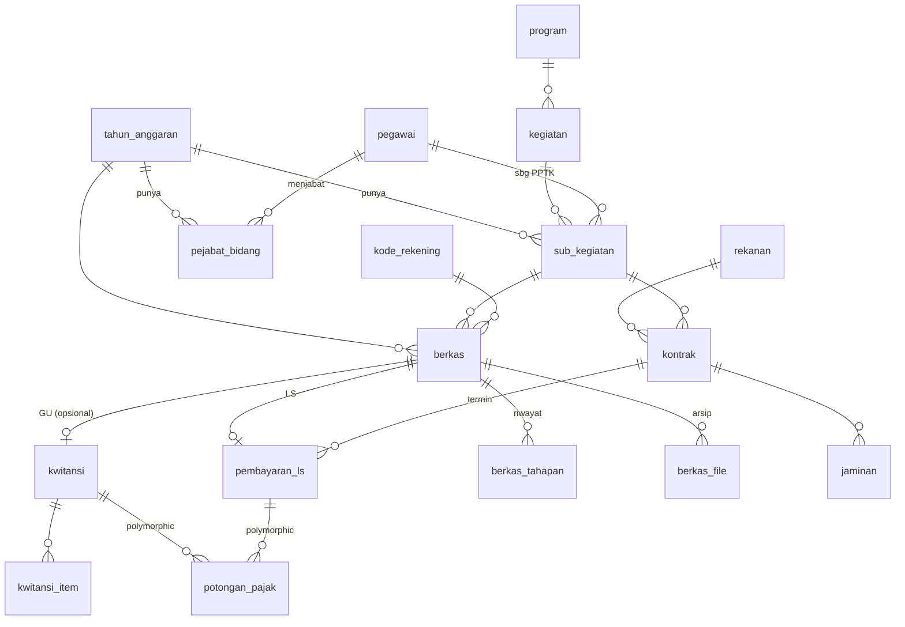

# Desain Teknis — SAKU

| | |
|---|---|
| **Versi** | 0.1 |
| **Tanggal** | 8 Juli 2026 |
| **Basis** | [PRD v0.2](PRD.md) |
| **Status** | Aktif — stack final (§1): **Laravel 12 + Filament v5 + mPDF**; master data di-seed dari ekstraksi Excel |

Dokumen ini menerjemahkan PRD menjadi arsitektur, skema database, dan pola implementasi. Semua penamaan tabel/kolom pakai `snake_case` Bahasa Indonesia agar dekat dengan domain (kwitansi, berkas, tahapan) dan mudah dibaca saat query manual.

---

## 1. Keputusan Stack

| Area | Keputusan | Alasan |
|------|-----------|--------|
| **Framework** | **Laravel 12** | PRD awal minta Laravel 13 (rilis 17 Mar 2026), **tetapi Filament belum mendukung Laravel 13** per Jul 2026 (Filament v5 ≤5.3.5 butuh `illuminate/contracts ^11.28\|^12.0`). Karena UI bergantung pada Filament → pakai Laravel 12 (matang, tanpa breaking change dari 11). Jalur upgrade ke 13 (~10 menit) begitu Filament siap. PHP 8.3.16. |
| **UI** | **Filament v5** (di atas Livewire 3) | App ini mayoritas CRUD internal + tabel + form; kebutuhan "custom"-nya adalah *perilaku* (rincian item berulang, hitung/terbilang live, form varian, wizard LS, tabel arsip berfilter), bukan tampilan artistik — persis kekuatan primitif bawaan Filament (Repeater, `live()`, Wizard, Tables, Actions). Satu pengguna, tak perlu SPA. Fase 1 jauh lebih cepat. |
| **PDF** | **mPDF** (pure PHP) | Pure PHP → deploy di Laragon tanpa Node/Chromium; dukung ukuran **F4/Legal**, tabel kompleks, dan teks Indonesia. Cukup untuk layout kwitansi/BAP/rincian. Cadangan bila satu layout mentok: Browsershot (butuh Node+Chromium). *Catatan: lapisan PDF ini murni Blade+mPDF, terpisah total dari Filament.* |
| **DB** | MySQL/MariaDB (bawaan Laragon) | Sesuai environment. |
| **Penyimpanan file** | Disk lokal `storage/app/arsip` (lihat §7) | Scan bisa puluhan MB; jangan di DB. |

Keputusan stack final (8 Jul 2026). Paket pendukung: `filament/filament:^5`, `mpdf/mpdf`, dan (Fase 3) `pxlrbt/filament-excel` atau `maatwebsite/excel` untuk ekspor.

> **Gerbang penerimaan Fase 1:** sebelum membangun modul penuh, buat **satu prototipe PDF kwitansi GU makan-minum** (layout paling ramai: header + rincian item + blok pajak + 4 blok TTD) dan bandingkan sisi-sisi dengan cetakan Excel asli. Hasil uji ini yang memutuskan mPDF cukup atau harus Browsershot. Ini menghindari membangun 5 modul di atas pilihan PDF yang ternyata tak memadai.

---

## 2. Arsitektur & Struktur Aplikasi

Aplikasi Laravel tunggal, dikelompokkan per domain (bukan micro-service). Struktur namespace:

```
app/
  Models/              # Eloquent: TahunAnggaran, Pegawai, SubKegiatan, Berkas, Kwitansi, Kontrak, ...
  Filament/
    Resources/         # CRUD master + Berkas (list/tabel/tracking) + Kontrak LS
    Pages/             # Halaman kustom: Buat Kwitansi GU, Buat Paket LS (wizard), Dashboard Rekap
    Widgets/           # Kartu rekap & daftar "belum diarsipkan" (Fase 3)
  Http/Controllers/
    CetakController.php # endpoint unduh/stream PDF (kwitansi, bap, rincian, resume) — di luar Filament
  Services/
    Terbilang.php      # angka→rupiah, tanggal→kalimat legal
    PathArsip.php      # generator path Tahun/SubKeg/Triwulan/Rekening
    PembayaranLs.php   # perhitungan DPP/PPN/PPh + riwayat termin
    PdfKwitansi.php    # render mPDF dari Blade view
  Enums/
    JenisBerkas.php    # gu | ls
    SumberBerkas.php   # dibuat | titipan
    PeranPejabat.php   # kpa | bendahara_pembantu | sekretaris | ppk
    JenisPajak.php     # ppn | pph22 | pph21 | pph23 | pph4_2 | pajak_resto
    TahapBerkas.php    # daftar tahapan GU & LS
resources/views/pdf/   # template Blade khusus cetak (kwitansi, bap, rincian, resume) — CSS mm + @page F4, terpisah dari Filament
```

**Prinsip pemisahan penting — hub `berkas` vs dokumen tercetak.** Tabel `berkas` adalah *unit yang dilacak & direkap*, mereferensikan master lewat FK hidup. Dokumen tercetak (`kwitansi`, `kontrak`, `pembayaran_ls`) menyimpan **snapshot** nilai master (nama/NIP pejabat, kode/nama sub kegiatan, dst.) pada saat dibuat. Konsekuensi:

- Rekap & pencarian selalu akurat lewat FK `berkas` (mengikuti master terkini).
- Cetakan lama tidak berubah walau master diedit tahun depan (pejabat ganti) — memperbaiki bug NIP-salah yang kita temukan di Excel.
- **Berkas GU titipan** = baris `berkas` tanpa baris `kwitansi`. Tetap punya nominal/sub kegiatan/rekening → tetap masuk rekap & arsip. (PRD R2b)

---

## 3. Model Domain (ERD)



Alur singkat: **GU** → `berkas(jenis=gu)` [+ `kwitansi` bila dibuat sendiri] → `berkas_tahapan` → `berkas_file`. **LS** → `kontrak` → tiap pembayaran `berkas(jenis=ls)` + `pembayaran_ls` → tahapan → arsip.

---

## 4. Skema — Master Data

### `tahun_anggaran`
| kolom | tipe | catatan |
|---|---|---|
| id | bigint PK | |
| tahun | smallint unique | mis. 2026 |
| is_aktif | boolean | hanya satu aktif; jadi filter default dropdown |
| keterangan | string null | |

### `pegawai`
| kolom | tipe | catatan |
|---|---|---|
| id | bigint PK | |
| nama | string | huruf kapital sesuai cetakan |
| nip | string(20) null | validasi 18 digit; null utk non-ASN/pihak ketiga |
| jabatan | string null | |
| golongan | string(10) null | utk standar biaya perjadin (P1) |
| no_rekening | string null | |
| bank | string null | |
| is_aktif | boolean | |

> Master ini menampung ±125 nama (impor dari sheet `Sheet1` file perjadin — P2/R15). Dipakai sebagai PPTK, penerima, dan pelaku perjadin.

### `program`, `kegiatan`, `kode_rekening` (referensi standar, lintas tahun)
- `program`: id, kode (`(1.03.06)`), nama.
- `kegiatan`: id, program_id FK, kode (`(1.03.06.2.01)`), nama.
- `kode_rekening`: id, kode (`5.1.02.01.01.0052`), uraian (`Belanja Makanan dan Minuman Rapat`).

### `sub_kegiatan` (per tahun anggaran — di-setup ulang tiap tahun, seperti sheet `V`)
| kolom | tipe | catatan |
|---|---|---|
| id | bigint PK | |
| tahun_anggaran_id | FK | |
| kegiatan_id | FK | |
| kode | string | `(1.03.06.2.01.0024)` |
| nama | string | `Peningkatan Sistem Drainase Perkotaan` |
| pptk_pegawai_id | FK pegawai | PPTK melekat per sub kegiatan/tahun |
| pagu | bigint null | opsional, utk cek pagu vs realisasi (P1) |

Unik: (`tahun_anggaran_id`, `kode`).

### `pejabat_bidang` (siapa memegang peran apa, per tahun)
| kolom | tipe | catatan |
|---|---|---|
| id | bigint PK | |
| tahun_anggaran_id | FK | |
| peran | enum PeranPejabat | kpa, bendahara_pembantu, sekretaris, ppk |
| pegawai_id | FK | |

Unik: (`tahun_anggaran_id`, `peran`). Ini yang membekukan "KPA 2026 = Elfha, Bendahara = Darmadi" tanpa hardcode.

### `rekanan` (penyedia LS)
id, nama_badan, nama_direktur, jabatan_direktur, alamat, bank, no_rekening, npwp. Semua string.

---

## 5. Skema — Berkas (hub) & GU

### `berkas` — unit yang dilacak & direkap (GU dan LS)
| kolom | tipe | catatan |
|---|---|---|
| id | bigint PK | |
| jenis | enum | `gu` \| `ls` |
| sumber | enum null | GU: `dibuat` \| `titipan` |
| tahun_anggaran_id | FK | |
| sub_kegiatan_id | FK | untuk rekap per sub kegiatan |
| kode_rekening_id | FK | untuk rekap per rekening |
| kontrak_id | FK null | terisi utk LS |
| uraian | string | ringkasan (untuk daftar & pencarian) |
| penerima_nama | string null | denormalisasi utk pencarian cepat |
| nominal | bigint | nilai berkas (rupiah, tanpa desimal) |
| tanggal | date | dasar penghitungan triwulan |
| triwulan | tinyint | 1–4, disimpan (bukan hanya dihitung) agar bisa di-index/filter |
| no_bku | string null | diisi **setelah** registrasi manual (NG4) |
| no_bku_tanggal | date null | |
| status | enum | `berjalan` \| `ditolak` \| `selesai` |
| catatan | text null | |
| timestamps | | |

Index: (`tahun_anggaran_id`,`sub_kegiatan_id`,`triwulan`), (`kode_rekening_id`), `no_bku`, fulltext(`uraian`,`penerima_nama`).

> `triwulan` dihitung otomatis dari `tanggal` di model event (`saving`): Jan–Mar=1 … Okt–Des=4. Disimpan agar path arsip & rekap tidak menghitung ulang.

### `kwitansi` — dokumen GU tercetak (opsional; tidak ada utk titipan)
Menyimpan **snapshot** untuk fidelity cetak:
| kolom | tipe | catatan |
|---|---|---|
| id | bigint PK | |
| berkas_id | FK unique | 1 berkas GU → 0/1 kwitansi |
| snap_tahun | smallint | tahun anggaran tercetak |
| snap_program_kode, snap_program_nama | string | |
| snap_kegiatan_kode, snap_kegiatan_nama | string | |
| snap_subkeg_kode, snap_subkeg_nama | string | |
| snap_rekening_kode, snap_rekening_nama | string | |
| snap_penerima_nama, snap_penerima_norek | string | |
| snap_pptk_nama, snap_pptk_nip | string | |
| snap_bendahara_nama, snap_bendahara_nip | string | |
| snap_kpa_nama, snap_kpa_nip | string | |
| uraian_pembayaran | text | "Untuk Pembayaran…" |
| terbilang | string | hasil `Terbilang::rupiah()` dibekukan |
| uang_sejumlah | bigint | sebelum pajak |
| total_diterima | bigint | setelah potongan |
| tanggal_dibuat | date | |

> Semua `snap_*` diisi dari master saat generate; sesudahnya independen. Nilai pajak ada di `potongan_pajak` (§6.3).

### `kwitansi_item` — rincian belanja (makan minum, dsb.)
id, kwitansi_id FK, uraian (`Makan`), volume (`35`), satuan (`Kotak`), harga_satuan (`40000`), jumlah (`1400000`), urutan.
Aturan: `SUM(jumlah) = kwitansi.uang_sejumlah` (divalidasi; tidak boleh beda — memperbaiki kelas bug Excel).

---

## 6. Skema — LS (Kontrak & Pembayaran Termin)

### `kontrak`
Menyimpan data kontrak + snapshot pejabat (field sesuai PRD T4):
- Identitas: `rekanan_id` FK, `tahun_anggaran_id`, `sub_kegiatan_id`, `kode_rekening_id`.
- Kontrak: `nomor`, `tanggal`, `tanggal_selesai`, `nilai`, `jangka_waktu_hari`, `lokasi`, `pekerjaan`, `konsultan_pengawas` null.
- DPA: `no_dpa`, `tanggal_dpa`.
- Addendum: `cco`, `tanggal_cco`, `addendum1_nomor/tanggal/biaya`, `addendum2_…` (semua null).
- Pajak default: `pph_persen` (default 1.75), `ppn_persen` (default 11, inklusif).
- Snapshot: `snap_pptk_nama/nip`, `snap_kpa_nama/nip`, `snap_npwp`.

### `jaminan`
id, kontrak_id FK, jenis (`uang_muka` \| `pelaksanaan`), penjamin, nomor, nilai, tanggal, masa_mulai, masa_selesai.

### `pembayaran_ls` — satu termin = satu berkas LS
| kolom | tipe | catatan |
|---|---|---|
| id | bigint PK | |
| berkas_id | FK unique | tercatat di hub `berkas` |
| kontrak_id | FK | |
| jenis | enum | `uang_muka` \| `termin` \| `akhir` |
| termin_ke | tinyint null | |
| persentase | decimal(5,2) | mis. 30.00 |
| nilai_bruto | bigint | = %×nilai kontrak (dibulatkan) |
| dpp | bigint | 100/111 × bruto |
| ppn | bigint | 11/111 × bruto |
| pph | bigint | pph_persen × dpp |
| potongan_uang_muka | bigint | pengembalian UM pada termin |
| nilai_neto | bigint | yang dibayarkan |
| no_bap, tanggal_bap | | |
| no_spp, no_spm, no_sp2d | string null | dicatat saat SIPD/BPKAD |

**Perhitungan (`Services\PembayaranLs`)** — menutup logika tabel rekapitulasi Rincian Pembayaran:
- "Pembayaran s/d BAP yang lalu" = `SUM` pembayaran_ls sebelumnya pada `kontrak_id` yang sama (urut `termin_ke`).
- "Total s/d BAP ini", "Sisa kontrak" = turunan.
- Pembulatan **`ROUND(…,0)` konsisten** di semua dokumen (bug Excel: dua dokumen beda pembulatan). Uji dengan angka kontrak asli CV Stand Alone sebagai fixture test.

---

## 6.3 Skema — Pajak (polymorphic, konfigurabel)

Satu tabel melayani GU & LS + semua jenis pajak (PRD T3):

### `potongan_pajak`
| kolom | tipe | catatan |
|---|---|---|
| id | bigint PK | |
| taxable_type, taxable_id | morphs | → `kwitansi` atau `pembayaran_ls` |
| jenis | enum JenisPajak | ppn, pph22, pph21, pph23, pph4_2, pajak_resto |
| dasar_pengenaan | bigint | DPP |
| tarif_persen | decimal(5,3) | mis. 1.500, 3.500, 7.000, 11.000, 1.750 |
| nominal | bigint | dpp × tarif |
| id_billing | string null | kode billing DJP (dicatat dari e-billing) |

Ini membuat tarif **per dokumen**, bukan hardcode — GU tanpa pajak (0 baris), GU makan-minum (resto 7%), GU dengan PPh22 1,5%/3,5%, LS konstruksi (PPN 11% + PPh 4(2) 1,75%) semua tertangani seragam.

---

## 6.4 Skema — Tracking & Arsip

### `berkas_tahapan` — log tahapan (bukan kolom tetap)
| kolom | tipe | catatan |
|---|---|---|
| id | bigint PK | |
| berkas_id | FK | |
| tahap | enum TahapBerkas | lihat daftar di bawah |
| tanggal | date | |
| nomor | string null | No. NPD / No. TBP / No. referensi transfer / dst. |
| catatan | text null | mis. alasan bila dikembalikan |
| created_at | | |

"Tahap terakhir" pada daftar = baris terbaru per `berkas`. Model log (bukan kolom boolean tetap) mendukung: pengisian tidak berurutan, titipan yang melewati draf/cetak, dan berkas yang dikembalikan lalu maju lagi.

**Daftar tahap (enum):**
- GU: `draf, cetak, ttd_penerima, ttd_pptk, ttd_bendahara, ttd_kabid, verifikasi_um, registrasi_bku, paraf_sekretaris, input_sipd, input_npd, transfer_bank, tbp, scan, arsip`
- LS: `dokumen_selesai, berkas_pptk_terkumpul, verifikasi_pembangunan, di_bpkad, sp2d_terbit, scan, arsip`
- No. BKU tetap disimpan di `berkas.no_bku` (untuk pencarian/rekap), dan bisa juga tercatat sebagai tahap `registrasi_bku`.

### `berkas_file` — arsip & lampiran
| kolom | tipe | catatan |
|---|---|---|
| id | bigint PK | |
| berkas_id | FK | |
| jenis_file | enum | `kwitansi_generated` \| `scan_final` \| `nota` \| `bukti_transfer` \| `lainnya` |
| path | string | relatif thd disk `arsip` |
| nama_asli | string | |
| mime, ukuran | | |
| halaman | int null | jumlah halaman PDF |
| uploaded_at | | |

Berkas dengan `status=selesai`/tahap `cair` tetapi **tanpa** `berkas_file(jenis=scan_final)` → muncul di daftar "belum diarsipkan".

---

## 7. Penyimpanan File & Path Arsip

**Disk** (`config/filesystems.php`): `arsip` → root `storage/app/arsip`. (Bisa diarahkan ke folder OneDrive/Drive lokal bila ingin sinkron pihak ketiga; keputusan Q4.)

**Generator path (`Services\PathArsip`)** dari metadata `berkas`:
```
{tahun}/{kode+nama sub kegiatan}/Triwulan {I|II|III|IV}/{kode rekening}/
```
Contoh: `2026/(1.03.06.2.01.0024) Peningkatan Sistem Drainase Perkotaan/Triwulan II/5.2.04.02.007.00001/`.
Nama file konsisten: `{JENIS} {uraian singkat} {tanggal}.pdf` → cocok dengan pola arsip yang sudah kamu pakai, sehingga bila R12 (Drive sync) jadi, struktur di SAKU = struktur di Drive.

*Slug/sanitasi* nama folder: buang karakter ilegal Windows (`\ / : * ? " < > |`), pertahankan tanda kurung kode.

**Backup (wajib — hosting lokal, PRD §11):**
- Nightly `mysqldump` DB + `zip` folder `storage/app/arsip` → simpan ke folder OneDrive/eksternal.
- Dijalankan lewat Laravel Scheduler + Windows Task Scheduler (Laragon punya `cronical`).
- Retensi mis. 14 harian + 1 mingguan.

---

## 8. Pola Implementasi Kunci

**8.1 Terbilang (`Services\Terbilang`)** — dua fungsi, wajib ada test:
- `rupiah(int $n): string` → `"(satu juta sembilan ratus dua puluh lima ribu rupiah)"`. Test fixture dari nominal asli: 1.000.000; 1.925.000; 239.332.200; kasus "belas"/"puluh"; nol; ≥ miliar.
- `tanggalLegal(Carbon $d): string` → `"Pada hari ini, Senin Tanggal Lima Belas Bulan Juni Tahun Dua Ribu Dua Puluh Enam"` untuk BAP. Hari & seluruh komponen dalam huruf.

**8.2 Snapshot on generate.** Saat kwitansi/kontrak dibuat, service menyalin nilai master → kolom `snap_*`. Edit master berikutnya tidak menyentuh dokumen lama. Regenerasi PDF memakai `snap_*`, bukan join ke master.

**8.3 Validasi anti-bug (mengunci kelas kesalahan dari Excel):**
- Jumlah rincian item = nilai kwitansi (tak bisa beda).
- Tahun anggaran dokumen = tahun aktif master (tak bisa "2025" nyasar di berkas 2026).
- Pejabat/NIP hanya dari master (tak ada input NIP manual).
- Pembulatan pajak/termin lewat satu service (konsisten lintas dokumen).

**8.4 Duplikasi berkas (R8).** `Berkas::duplicate()` menyalin isi tapi **mengosongkan** `tanggal`, `no_bku`, `no_bku_tanggal`, seluruh `berkas_tahapan`, dan `berkas_file` — mencegah data basi ikut ter-copy (bug 53-sheet Excel).

**8.5 PDF.** View Blade di `resources/views/pdf/*` dengan CSS ukuran mm + `@page { size: F4 }`; di-render `Services\PdfKwitansi` via mPDF. Satu partial header dipakai ulang lintas varian; blok rincian/pajak/TTD sebagai partial kondisional.

---

## 9. Urutan Build — Fase 1 (Fondasi + GU)

1. `composer create-project laravel/laravel:^12` + install Filament v5 + `mpdf/mpdf`; buat panel + user admin 1 akun (`php artisan make:filament-user`). PHP 8.3.16. Git init.
2. Migrasi & model master: `tahun_anggaran`, `pegawai`, `program`, `kegiatan`, `sub_kegiatan`, `kode_rekening`, `pejabat_bidang`, `rekanan`. Filament Resource CRUD + **seeder data 2026 hasil ekstraksi dari file Excel** (sheet `V` untuk sub kegiatan/PPTK/pejabat/rekening; `Sheet1` file perjadin untuk ~125 pegawai). Wajib diverifikasi user sebelum dipakai (data Excel banyak yang basi/salah).
3. `Services\Terbilang` + unit test (gerbang: semua fixture hijau).
4. Migrasi `berkas`, `kwitansi`, `kwitansi_item`, `potongan_pajak`. Model + relasi + event `triwulan`.
5. **Prototipe PDF kwitansi makan-minum** (Blade `pdf/kwitansi` + mPDF) → uji banding cetakan asli → konfirmasi mPDF memadai (fallback Browsershot bila mentok).
6. Halaman/Resource Filament "Buat Kwitansi GU" (Repeater rincian item, field `live()` untuk terbilang; varian: polos / rincian / rincian+pajak) → Action cetak → `CetakController` generate + simpan PDF.
7. Titik masuk "Daftar berkas titipan" (R2b) — form metadata tanpa generate (bisa jadi Create-variant di Berkas Resource).
8. Migrasi `berkas_file` + upload scan (Filament FileUpload) + `Services\PathArsip` + daftar/pencarian arsip (R5, Filament Table + filter).
9. Daftar "belum diarsipkan" + pencarian/filter dasar.

Fase 2 (tracking `berkas_tahapan` + LS `kontrak`/`pembayaran_ls`/`jaminan` + perjadin) dan Fase 3 (rekap/ekspor/Drive) menyusul sesuai PRD §13.

---

## 10. Pertanyaan Teknis Terbuka

| # | Pertanyaan | Dampak |
|---|---|---|
| TQ1 | ~~Konfirmasi stack~~ — **selesai:** Laravel 12 + Filament v5 + mPDF | — |
| TQ2 | ~~Versi framework~~ — **selesai:** Filament belum dukung Laravel 13 (Jul 2026) → pakai Laravel 12. Cek ulang dukungan Laravel 13 saat mulai coding & saat mau upgrade | — |
| TQ3 | Disk arsip: `storage/app/arsip` lokal, atau langsung ke folder OneDrive yang tersinkron ke Drive? (kaitannya Q4 PRD) | Konfigurasi disk & strategi backup |
| TQ4 | Perjadin (P1): standar biaya (uang harian/penginapan per golongan) jadi master, atau ketik manual? | Skema `pegawai.golongan` + tabel SBU |
| TQ5 | Apakah perlu audit trail perubahan (siapa/kapan edit master pejabat), atau cukup snapshot per dokumen? | Paket audit (mis. `owen-it/laravel-auditing`) |

---

*Riwayat: v0.1 — desain awal dari PRD v0.2. Stack final dikonfirmasi 8 Jul 2026: Laravel 12 + Filament v5 (Filament belum dukung Laravel 13) + mPDF; master data di-seed dari ekstraksi Excel.*
